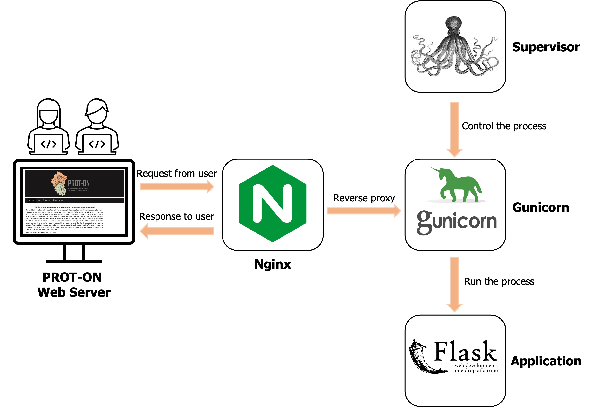

<p align="center">
  
</p>

[](https://doi.org/10.3389/fmolb.2023.1063971)


### PROT-ON: A Structure-Based Detection of Designer PROTein Interface MutatiONs

### Background

PROT-ON's aim is to identify key protein-protein interaction (PPI) mutations that can aid in redesigning new protein binders. It accomplishes this by using the coordinates of a protein complex to explore all possible interface mutations on a selected protein monomer with either [EvoEF1](https://github.com/tommyhuangthu/EvoEF) or [FoldX](http://foldxsuite.crg.eu/). The resulting mutational landscape is then filtered based on stability and, optionally, mutability criteria. Finally, PROT-ON performs a statistical analysis of the energy landscape created by the mutations to suggest the most enriching and depleting interfacial mutations for binding. PROT-ON can be work on both [stand-alone](https://github.com/CSB-KaracaLab/prot-on) and [PROT-ON webserver](http://proton.tools.ibg.edu.tr:8001).

### PROT-ON Architecture

#### Code Architecture

The PROT-ON tool is designed with a modular architecture that includes the following components:
1. **Interface Analysis**: Identifying amino acids on the protein surface that interact with its partner (`interface_residues.py`).
2. **Mutation Modeling**: Using EvoEF1 and FoldX to generate mutants and calculate binding energies  (`energy_calculation_[EvoEF/FoldX].py`).
3. **Statistical Analysis**: Classifying the mutations based on their impact on binding energy  (`detect_outliers.py`).

<p align="center">

</p>

#### Webserver Architecture

PROT-ON web application was developed using Flask, Bootstrap, HTTP, CSS, JavaScript, Celery, RabbitMQ, SQLAlchemy, Nginx, Gunicorn, and Supervisor packages and services. The purposes of using these packages and services are provided below.

1. **Frontend**: HTML, CSS, and JavaScript, Bootstrap for the user interface.
2. **Backend**: Python scripts and [Flask](https://flask.palletsprojects.com/en/3.0.x/) for handling requests and running the mutation analysis.
3. **Database**: Storing result data with SQLAlchemy.
4. **Task Queue**: Using [RabbitMQ](https://www.rabbitmq.com/tutorials/tutorial-one-python) and [Celery](https://docs.celeryq.dev/en/stable/) for managing background tasks.
5. **Server**: Deploying the webserver with [Nginx](https://nginx.org/en/docs/), supervisor and gunicorn.

<p align="center">

</p>

<p align="center">

</p>

### Usage

#### System dependencies

* python3 OR conda (version 4.10 or higher)
* Linux
* [FoldX 4.0](http://foldxsuite.crg.eu/) (optional)
* RabbitMQ
* Nginx
* Supervisor
* Celery

### Python dependencies (also listed in requirements.txt)
* flask
* plotly
* python-dotenv
* SQLAlchemy
* request
* pandas
* numpy
* kaleido
* flask-mail
* gunicorn

#### Clone Repository

```
git clone https://github.com/mehdikosaca/prot-on_web.git
```
```
cd prot-on_web
```

Before the install dependencies, you must change returning result address by editing the all `proton.tools.ibg.edu.tr:8001`sections in the `app.py` with your domain ID or IP. You can also change the e-mail address to which the results are sent. For this, Please press `command/ctrl + f`, type `Fill with your e-mail here`, and edit with your e-mail in `app.py` script. Also if needed, you must change `MAIL_PORT`. 

#### EvoEF1 and FoldX Installation

`library` and `src` folders are necessary to obtain EvoEF executable file. Please do not change or delete any files in those folders. Firstly, run the following command to create EvoEF executable file.

for Linux:
```
g++ -O3 --fast-math -o EvoEF src/*.cpp
```

If you want to analyze your complex with FoldX, you need to move the FoldX executable script named `foldx` and the `rotabase.txt` file to the working directory.

#### Environment Setup

Create a virtual environment and install dependencies

```
python3 -m venv <environment-name-you-choose>
source <environment-name-you-choose>/bin/activate
pip install -r requirements.txt
```

#### Installation of RabbitMQ

RabbitMQ is a message broker application used to manage background tasks in the PROT-ON webserver. To download and install RabbitMQ, run the following command

To install RabbitMQ for Linux:
```
sudo apt-get install rabbitmq-server
```

To initate it for Linux:
```
sudo rabbitmq-server -detached
```

Now, you should configure the RabbitMQ server settings to create a new user on host server and set permissions.

for Linux
```
sudo rabbitmqctl add_user <username> <password>
sudo rabbitmqctl add_vhost <hostname>
sudo rabbitmqctl set_permissions -p <hostname> <username> ".*" ".*" ".*"
```

#### Deployment of the Server with Nginx

Firstly, Gunicorn configuration is needed. Gunicorn is used to process to serve PROT-ON's Flask app.
```
gunicorn app:flask_app -b localhost:8000 &
```
You can configure the Gunicorn process to listen on any open port (You can terminate the terminal after this step.).
Running Gunicorn in the background will work fine for your purposes here. However, a better approach would be to run Gunicorn through Supervisor.

Supervisor allows you to monitor and control multiple processes on UNIX-like operating systems. It will oversee the Gunicorn process, ensuring it restarts if something goes wrong or starts at boot time.

To install supervisor:
```
sudo apt-get install supervisor
```
Then, create a Supervisor configuration file in `/etc/supervisor/conf.d/` and configure it according to your requirements Before configuration, you must create `prot-on` folder under `/var/log` directory.

```
[program:prot-on]
directory=/path/your/prot-on/directory
command=/path/your/prot-on/environment/bin/gunicorn app:flask_app -b localhost:8000
autostart=true
autorestart=true
stderr_logfile=/var/log/prot-on/prot-on.err.log
stdout_logfile=/var/log/prot-on/prot-on.out.log
```

Run the following commands to enable the configuration.

```
sudo supervisor reread
sudo service supervisor restart
```

**If you change/update anything on the server files/scripts, you must rerun below commands.** You can check the status of all monitored apps, use the following command

for Linux:
```
sudo service supervisor restart
```

After that, we need to deploy our service on a DNS or IP address. First of all, Nginx must be downloaded:

To install:
```
sudo apt-get install nginx
```

Now, a server block must be established for PROT-ON application
For Linux:
```
sudo vim /etc/nginx/conf.d/prot-on.conf
```

Then, paste the following configuration

```
server {
    listen       80;
    server_name  your_public_dnsname_here_or_ip_address;

    location / {
        proxy_pass http://127.0.0.1:8000;
    }
}
```

The proxy pass directive should match the port on which the Gunicorn process is listening.

Restart the nginx web server.

```
sudo nginx -t
sudo service nginx restart
```

## Installation of Celery

Celery is a distributed task queue framework. It is used for handling asynchronous or scheduled tasks. It allows you to run and manage background jobs. Use the following command to install Celery (**You have to deactivate the environment to install and use the Celery**)

```
sudo apt-get install celery
```
Celery need to root access to run. In that case the Python dependencies of PROT-ON need to be installed with elevated privileges, so please ensure to use sudo -H when downloading and installing them.

```
sudo -H pip3 install pandas
sudo -H pip3 install flask
sudo -H pip3 install python-dotenv
sudo -H pip3 install plotly
sudo -H pip3 install flask-mail
sudo -H pip3 install sqlalcehmy
sudo -H pip3 install kaleido
sudo -H pip3 install numpy
```
You can start to use Celery in PROT-ON directory, after these installations.

#### To Run the PROT-ON Webserver

Before running the PROT-ON application, you must create an environment file named .env for Celery configuration. This file should include user information for the RabbitMQ server, as shown below.
```
CELERY_BROKER_URL=amqp://<username>:<password>@localhost/<hostname>
CELERY_BACKEND_URL=db+sqlite:///proton.db
SECRET_KEY="YOUR_SECRET_KEY"
```

Now, your PROT-ON application successfully deployed and can accessible by typing DNS name or IP address on your browser. As a last step you must open two terminal tabs on PROT-ON working directory, and run following commands to initate background and scheduled tasks, respectively. Note that, if any change or bugs occured in the scripts, please rerun the followings.

```
sudo celery -A app.celery worker --loglevel==info
sudo celery -A app.celery beat --loglevel == info
```

### PROT-ON Output Files

* **Interface amino acid list:** Interfacial amino acid list (within a defined cut-off), belonging to the input chain ID, calculated by interface_residues.py. The same script outputs the pairwise contacts, as a Pairwise distance list.

* **Mutation models:** Generated mutant models modeled by BuildMutant command of EvoEF1 or BuildModel command of FoldX.

* **Individual EvoEF1/FoldX files:** EvoEF1/FoldX binding affinity predictions calculated by ComputeBinding of EvoEF1 or AnalyseComplex of FoldX (proton_scores).

* **Boxplot of EvoEF1/FoldX scores:** All EvoEF1/FoldX binding affinity predictions are analyzed with the box-whisker statistics, where;

* **Depleting mutations:** are defined by the positive outliers, and;

* **Enriching mutations:** are defined by the negative outliers.

* **Heatmap of PROT-ON scores:** All possible mutation energies are plotted as a heatmap for visual inspection.

* **Filtered mutations:** Stability-filtered (uses ComputeStability command of EvoEF1 or Stability command of FoldX, where DDG-stability<0) enriching and depleting mutations and optionally PSSM-filtered (Enriching mutations with PSSM-score >0 && Depleting mutations with PSSM-score <=0).

* **Heatmap_df:** A dataframe which is used to generate the heatmap.

* **Parameters:** Parameters file including the submitted cut-off and IQR ranges.

### For Future Updates

This section includes valuable information for future updates of PROT-ON codes. If you want to update anythings, please follow below instructions.

* **To define a new alert:** First, define your alert code as a function in `alert.py`, then call it in the "Check" function in the `app.py` script. ([See for more information](https://flask.palletsprojects.com/en/1.1.x/patterns/flashing/)) 

* **To add a new analyzing method:** If you want to add a new analysis method to PROT-ON, you must first create an object-oriented script to analyze the input structure, similar to __energy_calculation_EvoEF1.py__. Then, import it into `app.py`. Finally, call it in the `proton` function.

* **To define a new celery task:** If you want to define a new Celery task, you need to follow a few steps. First, define the task in the Flask configuration section in the `app.py` script. Next, create a new task function. Before the function, add the __@celery_task__ decorator. Finally, create a script such as **task.py**, import it into **app.py** and call it wherever you need ([See for more information](https://docs.celeryq.dev/en/main/userguide/tasks.html))

* **To edit the e-mail address or e-mail content:** E-mail configuration settings are present in the `app.py`script. To change the e-mail address press `command/ctrl + f`, type `Fill with your e-mail here`, and edit all with your e-mail. If needed please change the **MAIL_SERVER, MAIL_PORT, and MAIL_USE_TLS** settings. If you want to change mail content, please edit `SendMail` function in the app.py. 

* **To edit mandatory run results:** If you want to edit mandatory run results, you can add or drop folders in the **periodic_task** function in **app.py** script.

* **To edit result page:** You can manipulate the `ResultPage` function in the *app.py* and `result.html` script to change the result page template. 

* **To edit homepage** You can manipulate the `index.html` script to change the homepage template. Additionally, you can edit the `result` function in the `app.py` script if any changes occur in the index form.

* **To edit statistical methods:** You can directly manipulate the `detect_outliers.py` script if any edits are necessary in the statistical analysis methods.

* **Other HTML pages:** `Layouts.html` file serves as a layout page and is inherited by many other HTML pages. The `pre_calculated_runs.html` file includes information about pre-calculated runs. The files`404.html, about.html, help.html, refresh.html` are static pages. These pages are returned for specific purposes: **404.html** for page not found errors, **about.html** for information about algorithm, **help.html** for some usage instructions, and **refresh.html** for waiting the results. There are also some html pages under *includes* folder. The **footer.html** is used for the footer section of pages, the **messages.html** is used for flash messaging, and the **navbar.html** is used for accessing the navigation menu.

### Citation

If you use the PROT-ON, please cite the following paper:
```
Koşaca, M., Yılmazbilek, İ., & Karaca, E. (2023).
PROT-ON: A structure-based detection of designer PROTein interface MutatiONs.
Frontiers in Molecular Biosciences, 10, 1063971.
```

### Bug Report & Feedback

If you encounter any problem, you can contact Mehdi or Ezgi via:

### Contacts

* ezgi.karaca@ibg.edu.tr
* mehdi.kosaca@ibg.edu.tr
